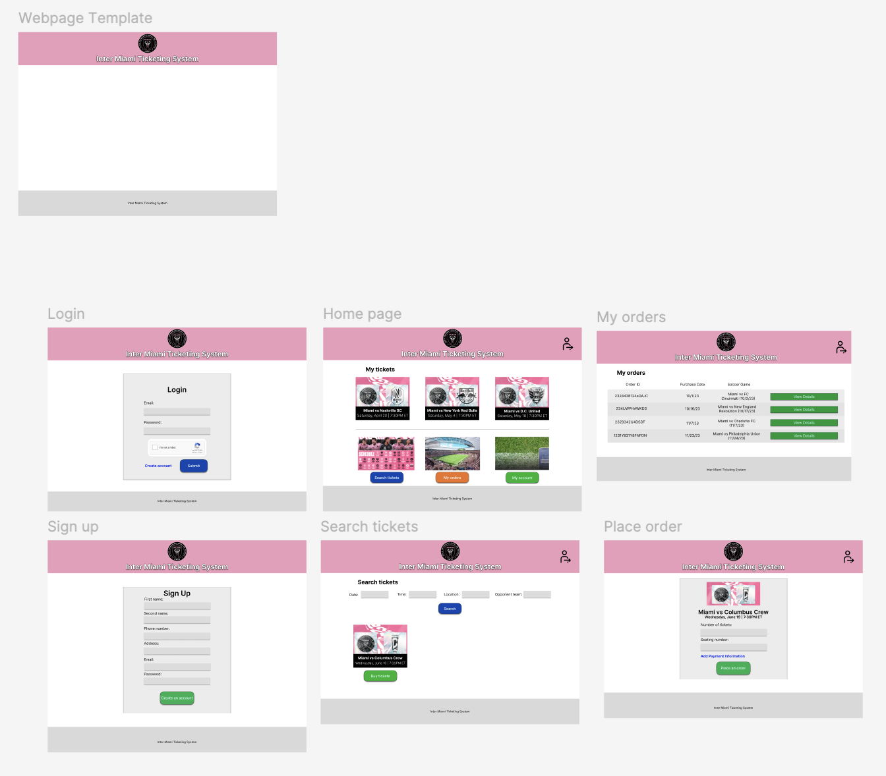
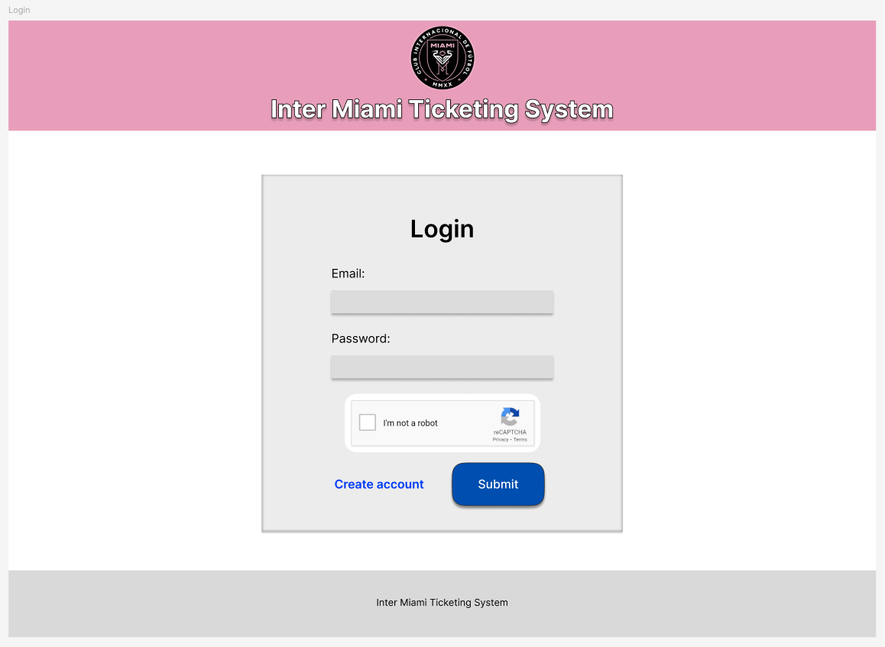
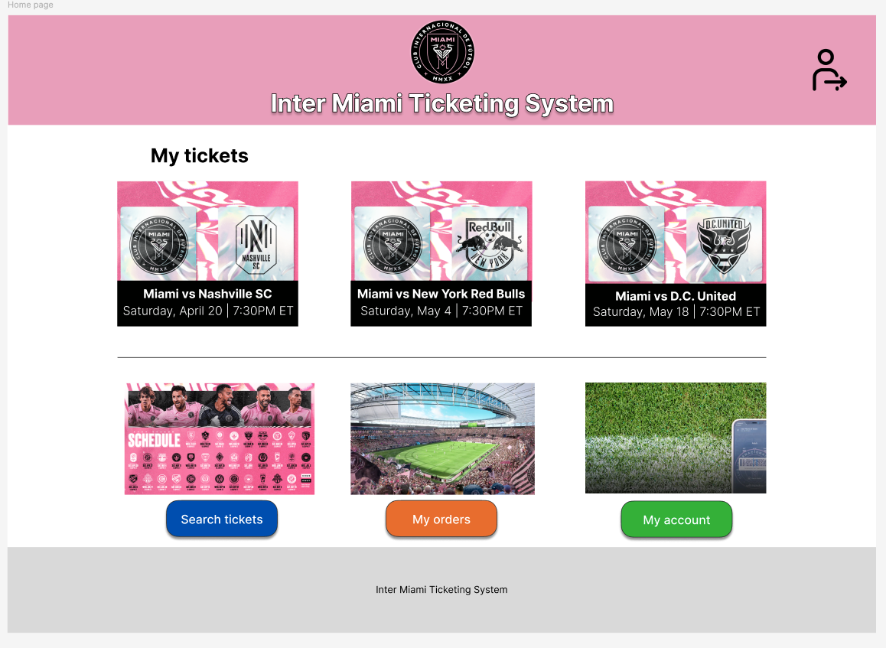

# Inter-Miami-Ticketing-System-Figma
Inter Miami Ticketing System, designed and created in [Figma](https://www.figma.com/)

### Demonstration:

  

### All pages:

  

### Login Page:

  

### Sign Up Page:

  

### Home Page:

  

### Search Tickets Page:

  

### Place an Order Page:

  

### My Orders Page:

  

Source: [Inter Miami CF Website](https://www.intermiamicf.com/)